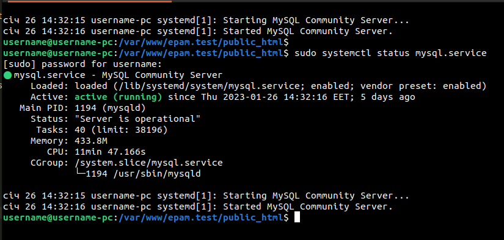

**The tasks will be finally completed and published by February 11, 2022.**



# Creating and Managing Databases in Linux

## MySQL

**Step 1.** Install MySQL Server

``` bash
sudo apt update
sudo apt install mysql-server
sudo systemctl start mysql.service
```

**Step 2.** Check MySQL Server Status

``` bash
sudo systemctl status mysql.service
```

**Step 3.** Create database

``` bash
sudo mysql
```

``` mysql 
CREATE DATABASE localhost_stage;
```

**Step 4.** Create user

``` mysql
CREATE USER 'defuser'@'localhost' IDENTIFIED BY 'password';
```

**Step 5.** Create role

``` mysql
CREATE ROLE 'defrole'@'localhost';
```

**Step 6.** Granting Privileges to Roles

``` mysql
GRANT SELECT, INSERT, CREATE, UPDATE, DELETE ON *.* TO 'defrole'@'localhost';
```

**Step 7.** Assign user account its required privileges

``` mysql
GRANT 'defrole'@'localhost' TO 'defuser'@'localhost';
```

**Step 8.** Check Role Privileges

``` mysql
SHOW GRANTS FOR 'defuser'@'localhost' USING 'defrole'@'localhost';
```

**Step 9** Activating Roles

``` mysql
SET DEFAULT ROLE 'defrole'@'localhost' TO 'defuser'@'localhost';
```

**Step 10.** Create MySQL dump

``` bash
mysqldump -u defuser -p localhost_stage > localhost_stage_2023_02_01.sql
```

**Step 9** Import MySQL dump

``` bash
mysql -u defuser -p localhost_stage < localhost_stage_2023_02_01.sql
```


